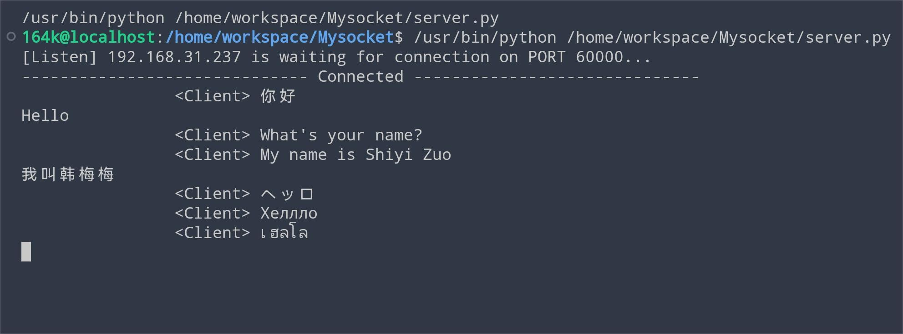

# 基于socket的windows与linux异步通信

本代码使用Python实现了socket的双向异步通信，其中分支**Linux_cmd**为命令行交互方式，配置IP与PORT仍需在py文件中实现。该分支可同时适用于各平台下的命令行；分支**Windows_GUI**使用一个基于*PyQt5*的框架*guietta*开发了一个简易的Windows的GUI窗口方便交互。该代码目前仅可实现局域网之间的通信。

## Linux_cmd
在该分支的目录下新建一个py文件，导入server_client.py中所有函数及变量：
```Python
from server_client import *
```
然后调用`run_server`函数或`run_client`函数来运行服务器或客户端。两个函数均可以传入`ip`、`port`来指定需要连接/绑定的地址。默认`ip='127.0.0.1'`、`port=60000`（或者直接运行已经写好的默认的server.py与server_client.py）。

之后在命令行等待连接，连接成功后就可以双向通信了。想结束对话，输入`exit`并回车即可；不过本代码实现是创建两个相互传输的socket来实现的，因此结束需要服务端与客户端都输入`exit`退出，程序才会结束。结束后，需要再次运行代码重启。

## Windows_GUI
运行`main.py`即可，不过需要先下载两个依赖，见[requirement.txt](requirements.txt)
```
guietta==1.4.1
PyQt5==5.15.7
```

初始窗口图片如下：


打开窗口后，输入`IP`与`PORT`，勾选想要的模式`Mode`，然后点击`Connect`连接或等待连接。目前的状态显示在`Status`之后，消息会显示在对话框中，使用最下面的输入框输入内容，按`send`发送。输入`exit`并发送可以结束连接，并可以继续使用下一次连接。

对话展示如下，使用UTF-8编码方式：


Linux上的服务端相应展示：



## IP & PORT

客户端与服务端的IP地址均填写服务端所绑定的IP地址。一般来说，若在本机同时运行server与client，IP只需为默认的`127.0.0.1`即可；若在局域网中两台机器分别运行，则IP填写为当前局域网的IP地址（IPv4），一般为`192.168.xx.xxx`。端口号默认为`60000`，可以替换为0~65536之间的任意无占用端口，不过需要保证两端端口设置一致。

# References

[1] guietta库文档 - https://guietta.readthedocs.io/en/latest/
